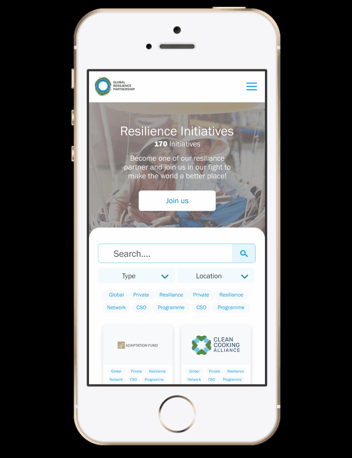

# Code and Collad module: GRP x Hyper Island

Brief interpretation: "Help the user find relevant information and interact with the content."

## Getting started

Open the app directly in your browser
https://spicysix.netlify.app/

## OR

Clone or Download this repo and run this app

```
`npm start`
```

Runs the app in the development mode.<br />
Open [http://localhost:3000](http://localhost:3000) to view it in the browser.

# Break down of the project

## Infographic

In this section there are a title and 3 cards. Here the plan is to have the numbers in the cards update when the database is updated. Normally the infographic section will have 2 cards, but for the special event that's happening another card can be added for more info. Some cards have a blue link icon on the top right, this indicates that you can click on the card to get to another page.

## Search functionalities

There are 3 options of search functionalities and it depends on how the database is built.

### Filter

For now the 2 main ways to divide the initiatives is with the **Type of initiative** and **Geographic region**. These categories are highlighted in the top left section of search. These filter function are for users that need some guidance on what they can search for.

### Text Search

At the right corner the user can freely search for any keyword of their choice. The words that are set for a match are the words in the title of the initiatives and the description text.

### Tags system

The tags are used to group the remaining keywords used in the excel sheet. The tags are used to get initiatives that do similar projects, but they are not bound my one specific area. The tags are the third option for users that need some overview of how they can start their search.

_The search function can be used in conjunction to each other._

## Cards

The cards contain a dynamic render of the excel sheet (which have been converted to json). The highlight here is the title, logo, description, tags and link to their page.

### Title and description

These are simply read from the json (excel database) and the size of the card is adjusted to the content length

### Logos

The logos are retrieved with an api, and it's available on https://clearbit.com/logo. We used the api and a separate Express server to first see if we can retrieve the logos, if it's found the logos will be written into the database. The next time we run the code on our website we just use the link that is provided with the api. The minimizes the amount of calls on client side.
The code used to retrieve the icons are on https://github.com/joakimhellgren/fetch-clearbit-logo

### Tags

The tags are created if the data in the json showed a "1".

```
"KnowledgeAndlearning": 1,
"FinanceAndBudgets": null,
```

This will give it a knowledge tag but not a finance tag.

### Link to page

This icon contains the link to the page. It's clickable and you get to their site on a new browser page.

## Suggestion of mobile website

We didn't have time to implement this feature, but we think it would be to value if GRP would implement something similar in the future


